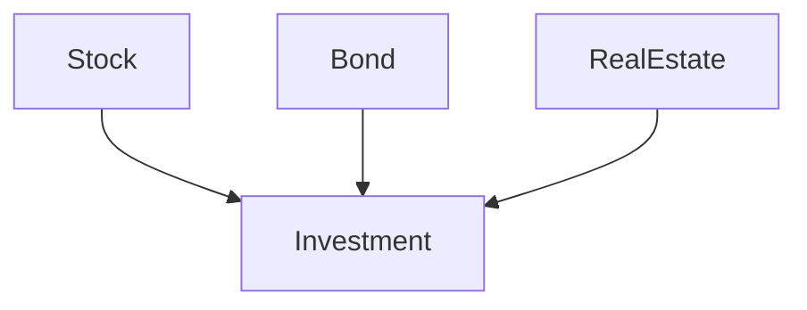

---
## What is unique_ptr ?
- *unique_ptr* is a *smart pointer* that have same size as *raw pointer* .
- It *small* enough and *fast* enough for use.
- It have own *resource management (RII)* .
- *std::unique_ptr* embodies *exclusive ownership semantics*. A *non-null* *std:: unique_ptr* always owns what it points to. Moving a *std::unique_ptr* transfers ownership from the source pointer to the destination pointer.
##### **std::unique_ptr** is thus a *move-only* type.

- **unique_ptr**  use *delete* for destroy object but we can configure *custom deleters*  : arbitrary functions (function object, lambda function) 
- Use *custom deleters* increase size of smart pointer its depend on how much state store in function object, Stateless function objects like Lambda expression is preferable:  
```cpp
auto delInvmt1 = [](Investment* pInvestment) {
	makeLogEntry(pInvesment);
	delete pInvestmnet;
} // lambda function

using delInvt2 = void (*)(Investment*); // function pointer

```

## Exceptions:
- If **exception** propagates out of the *thread*'s primary function.
- If a **noexcept** specification is violated.
- If *std::abort* , *std::Exite*, *std::exit*, *std::quick_exit* is called.


## Use Case
### Factory Function
A common use for *std::unique_ptr* is as a *factory function* _return type_ for objects in a *hierarchy*:

```cpp
class Investment {
public:
 ...
virtual ~Investment(); // essential design component!
}

class Stock: public Investmnet {...};
class Bond: public Investmnet {...};
class RealEstate: public Investmnet {...};
```



```cpp
template<typename... Ts> // return std::unique_ptr
std::unique_ptr<Investment> makeInvestment(Ts&&... params);// to an object created 
// from the given args


auto delInvmt = [](Investment* pInvestment) // custom
{ // deleter
	makeLogEntry(pInvestment); // (a lambda
	delete pInvestment; // expression)
};

template<typename... Ts> // revised
std::unique_ptr<Investment, decltype(delInvmt)> // return type
makeInvestment(Ts&&... params)
{
std::unique_ptr<Investment, decltype(delInvmt)> // ptr to be
pInv(nullptr, delInvmt); // returned
if ( /* a Stock object should be created */ )
	{
	pInv.reset(new Stock(std::forward<Ts>(params)...));
	}
else if ( /* a Bond object should be created */ )
	{
	pInv.reset(new Bond(std::forward<Ts>(params)...));
	}
else if ( /* a RealEstate object should be created */ )
	{
	pInv.reset(new RealEstate(std::forward<Ts>(params)...));
	}
return pInv;
}

// ---------------------------------------
// C++14 with more encapsulation fashion:
// ---------------------------------------
template<typename... Ts>
auto makeInvestment(Ts&&... params) // C++14
{
auto delInvmt = [](Investment* pInvestment) // this is now
{ // inside
	makeLogEntry(pInvestment); // makedelete
	delete pInvestment; // Investment
};

std::unique_ptr<Investment, decltype(delInvmt)> pInv(nullptr, delInvmt); 
	if ( … ) // as before
	{
	pInv.reset(new Stock(std::forward<Ts>(params)...));
	}
	else if ( … ) // as before
	{
	pInv.reset(new Bond(std::forward<Ts>(params)...));
	}
	else if ( … ) // as before
	{
	pInv.reset(new RealEstate(std::forward<Ts>(params)...));
	}
	return pInv; // as before
}
```


### Pimpl Idiom
That’s the technique whereby you replace the data members of a class with a pointer to an implementation class
### Convert to std::shared_ptr
most attractive features is that it easily and efficiently converts to a *std::shared_ptr*:
```cpp
std::shared_ptr<Investment> sp = makeInvestment(arguments);
```


---

>[!IMPORTANT] **Things to Remember**
>- *std::unique_ptr* is a small, fast, move-only *smart pointer* for managing resources with *exclusive-ownership semantics*.
>- By default, resource *destruction* takes place via delete, but custom deleters can be specified. *Stateful* deleters and function pointers as *deleters* increase the size of **std::unique_ptr** objects.
>-  Converting a **std::unique_ptr** to a **std::shared_ptr** is easy.

